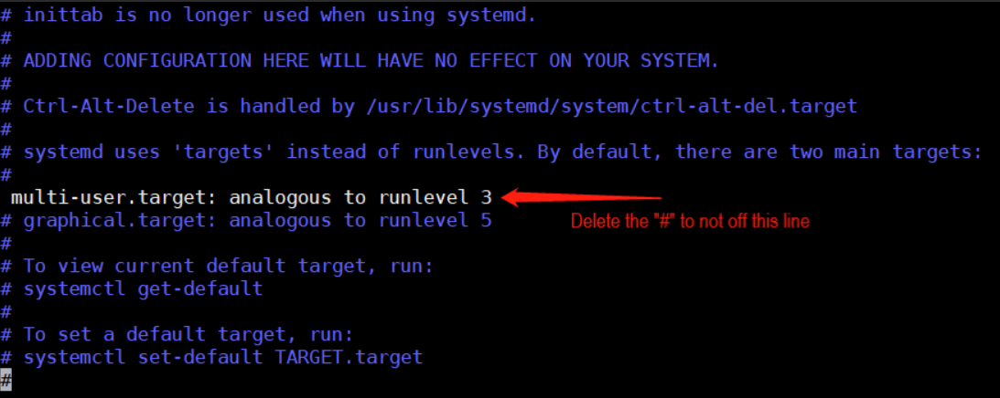
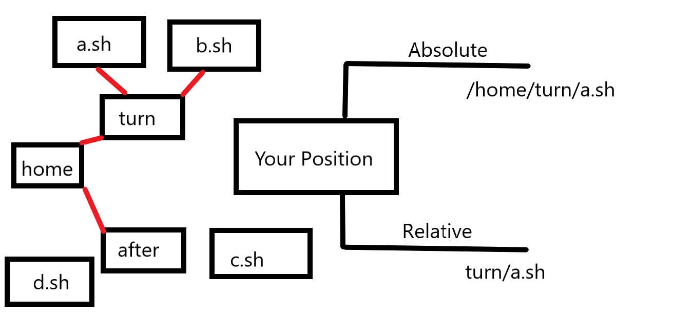

# Utility command

## Specify run level

### Introduction
- **0: shutdown**
- **1: single user (Find the password back)**
- **2: muti user status (No network service)**
- **_3: muti user status (With network service)_**
- **4: The system is not used and reserved for users**
- _**5: graphic interface**_
- **6: Reboot System**
</br> 

> Normally we'll give the users 3 or 5 run level, however, you can also specify the default allowed level

|**Command**|**Explanations**|
|----|----|
|`runlevel`|check the runlever of system now|
|`systemctl get-default`|Check the default run level at startup|
|`systemclt set-default multi-user.target`|Set the startup default operation level to multi-user graphic command mode `runlevel 3`|

- Go to the configuration file: `etc/inittab`


**Now reboot the system**

### After CentOS7
**CentOS7 simplified the file.**
> **Before the Centos7, the code in the file was:**


`muti-user.target: analogous to runlevel 3`
`Graphical.target: analogous to runlevel 5`
To view the current default target, run:
**`systemctl get-default`**
To set a default target, run:
**`systemtl set-default target.target`**

## Help Command

```Linux
man [Command or configuration file]
```
> Get help information

eg: `man ls`
In linux, the hidden files are start with `.`, the choice can be used combine.
for instance: `ls -al`, and `ls -al/root`

- **Help** command
  - `help` Get the shell command help

## File directory
#### `pwd` command
```Linux
pwd
```
> Show the absolute path of the file directory

#### `ls` command
```linux
ls [file or folder]
```
- **Common options**
  - `-a` show all of the files and folders, inclouding hidden files
  - `-l` show the information in list

#### `cd` command
```Linux
cd [path]
```
> Absolute path and relative path



```Linux
cd ~
```
> Return to the home directory

```Linux
cd ..
```
> Return to the upper level directory

#### `mkdir` command
- **Use `mkdir` to create a new directory(folder)**

```Linux
mkdir [-p] dirName
```
use `-p` to ensure that the directory name exists, and create one if it does not exits.

- **Example**
  - Make a directory: /home/dog
  - `mkdir -p /home/dog`

#### `rmdir` command

```Linux
rmdir [-rf] directory
```
- **Example**
  - Delete the directory /home/dog
  - `rmdir -rf /home/dog`

> [!TIP]
> **rmdir can only delete the empty directory.**
> **If you want to delete a directory that is not empty, you need to use `rm -rf`**

#### `touch` command

> Use `touch` to create the empty file

```Linux
touch [file name]
```
- **Example**
  - under the directory _/home_ create the file _Harry.txt_
  - `touch Harry.txt`
- **Beside**
  - If you need to create several files at the same time, use
  - `touch a.txt b.txt c.txt`
- **Change access or modification time only**
  - Use -a to change the file visit time to the time now
  - `touch -a a.txt`
  - Use -m to change the file modification time to the time now
  - `touch -m a.txt`
  - _If you use m to change the mtime of file, the file's ctime will be changed as well._

#### `cp` command
> The Linux `cp` command is mainly used to copy files or directories.

```Linux
cp [options] source dest
```
**or**
```Linux
cp [options] source... directory
```
- `-a`: This option is usually used when copying a directory. It retains links, file properties, and copies everything under the directory. Its function is equal to DPR parameter combination.
- `-d`: Keep links when copying. The links mentioned here are equivalent to shortcuts in Windows system.
- `-f`: Overwrite the existing target file without prompting.
- `-i`: Contrary to the - f option, the user is prompted to confirm whether to overwrite the target file before overwriting it. When answering y, the target file will be overwritten.
- `-p`: In addition to copying the contents of the file, the modification time and access rights are also copied to the new file.
- **`-r`**: If the given source file is a directory file, all subdirectories and files under the directory will be copied at this time.
- `-l`: Do not copy files, just generate linked files.' 

- **Example1**
  - copy `/home/hello/txt` to `/home/bbb`
  - `cp hello.txt /home/bbb`
- **Example2**
  - copy the whole directory `/home/bbb` to `/opt`
  - `cp -r /home/bbb /opt`


