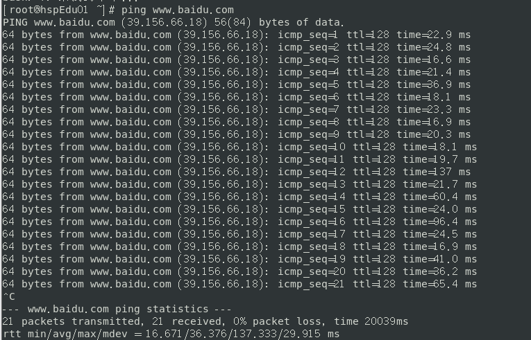

# Internet Config
## Linux Network Configuration Principle

### NAT Network Settings

- **Check the Network setting of your Linux setting first**
  - `ifconfig`

- **Then check the Network setting of your Machine**
  - `ipconfig`


> Your own machine which is using the internet have a _IP_
>> You can see that's a _vmnet8_ of the `ipconfig`

- **_IPconfig_**
  - **My computer's IP: 192. 168. 106**
  - **Linux's IP: 182. 168. 209. 255**
- **Which made it possible for Your machine to communicate with the virtual machine**


#### To be more specific 


## Specify IP
> You can specify any IP address directly through the configuration file

### EDIT
#### File path: `vi/etc/sysconfig/network-scripts/ifcfg-n33`

- **Configure the IP address to be static**
  - For instance the ip: 192.168.200.130

#### `ifcfg-ens33` file explanciation:
```Linux               
TYPE="Ethernet"                             # Network type(The default type is Ethenet)
PROXY_METHOD="none"
BROWSER_ONLY="no"
BOOTPROTO="dhcp"
DEFROUTE="yes"
IPV4_FAILURE_FATAL="no"
IPV6INIT="yes"
IPV6_AUTOCONF="yes"
IPV6_DEFROUTE="yes"
IPV6_FAILURE_FATAL="no"
IPV6_ADDR_GEN_MODE="stable-privacy"
NAME="ens33"
UUID="2dc42136-4a46-475e-bc00-b28ca948e433" # Random id
DEVICE="ens33"                              # Interface name(Device, Network Card)
ONBOOT="yes"                                # Determine whether the network interface is valid when the system is started(yes/no)
```

**Add the code below:**
```Linux
BOOTPROTO=static
IPADDR=192.168.200.130      # IP address
GATEWAY=192.168.200.2       # Gateway
DNS1=192.168.2              # Domain name resolver
```

> [!TIP] (Restart the net service or restart the system after that)

### Set host name
1. You can set the host name for the Linux system or modify the host name as needed
2. Command `hostname`: View hostname
3. Modify the file `/etc/hostname` to change it
4. After modification, restart
