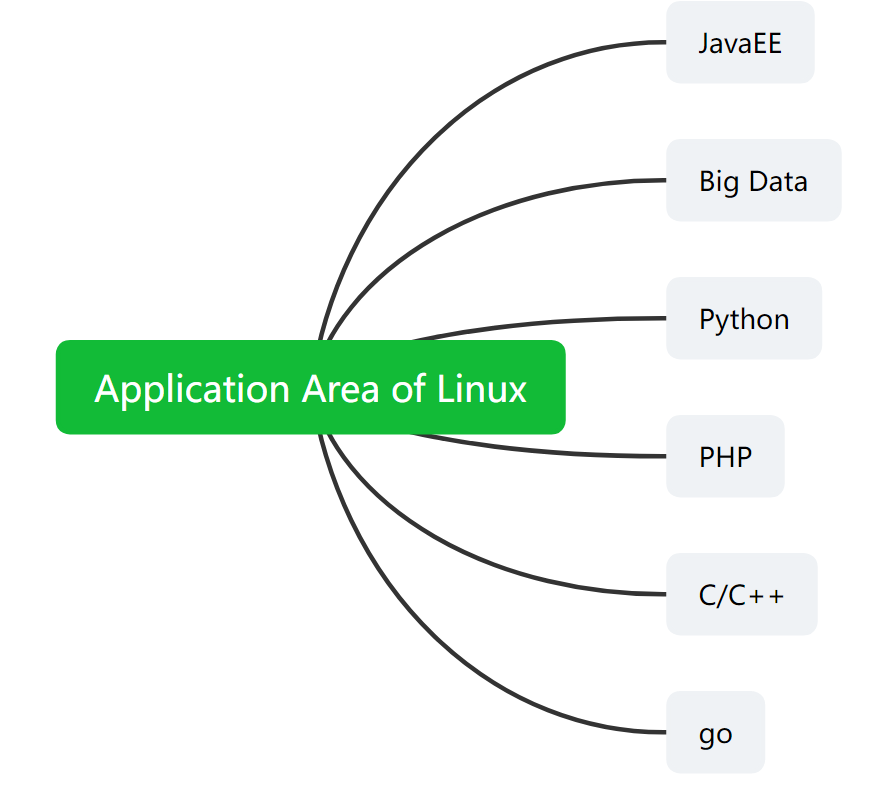

# 1.The application area of Linux

## What kind of job are you able to do?

## What about the things in our daily life?

- The Application to personal computer:
  - This part is actually the weakest part of Linux, which just used to have the black and ugly terminal window to do everything; However, with the development of ubuntu, fedora, and others, the percentage of a personal Linxu computer are becoming higher and higher.
- Server:
  - Without doubt, Linux was always the best in the field of server.
  - Free, stable, and efficient, the three features of Linux had showen wonderfully here. Especially in some high-technology area. (c/c++/php/java/python/go)
- Embedded System:
  - Linxu is stable in running the network server, and it's good support for network, low cost, can be changed easily from a large system to a small one which only contains hundreds of kb; These advantages of Linux had made a great imporvenment to our life.
- Main Applicaltions: set-top box, digital televsion, Internet phone, mobile phone, smart home; and it is believed to have more applications in the **IOT**.