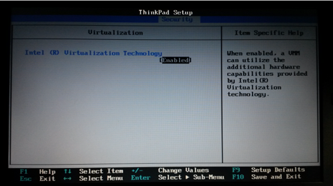
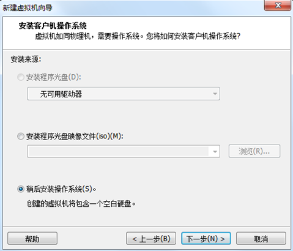
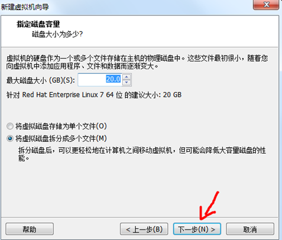
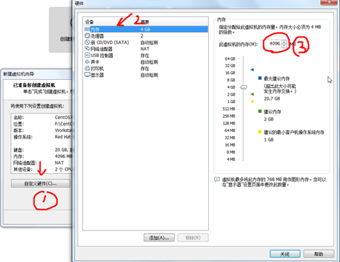
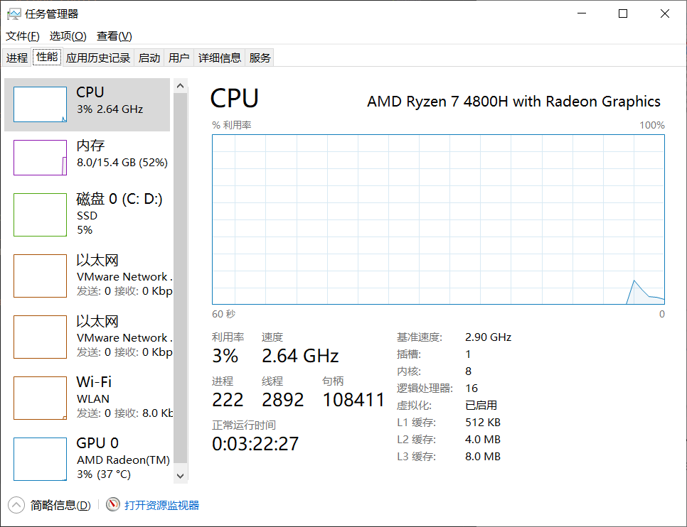
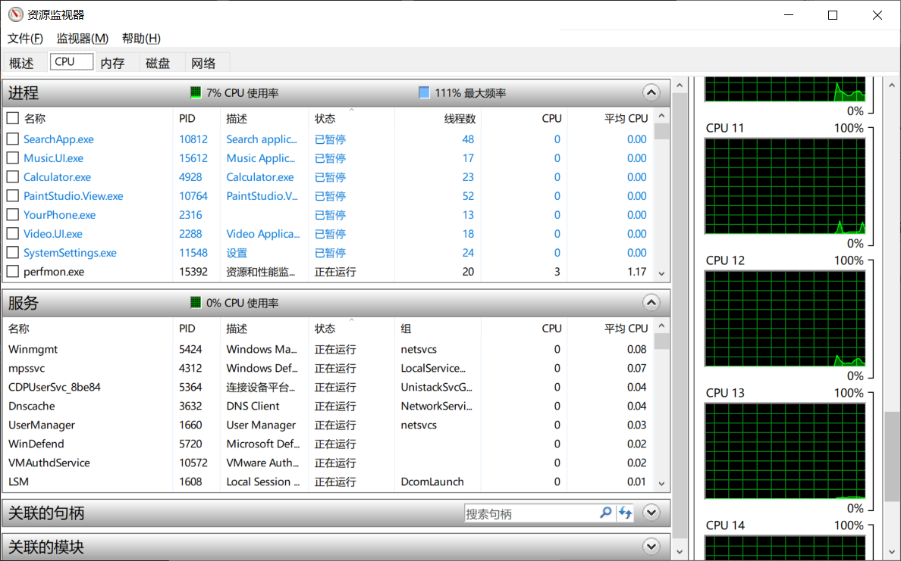
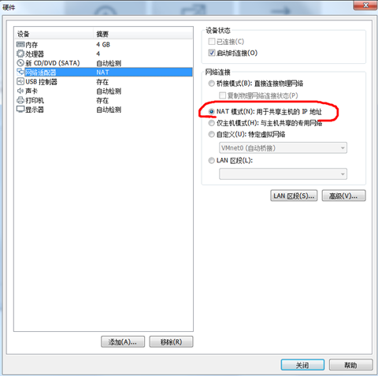
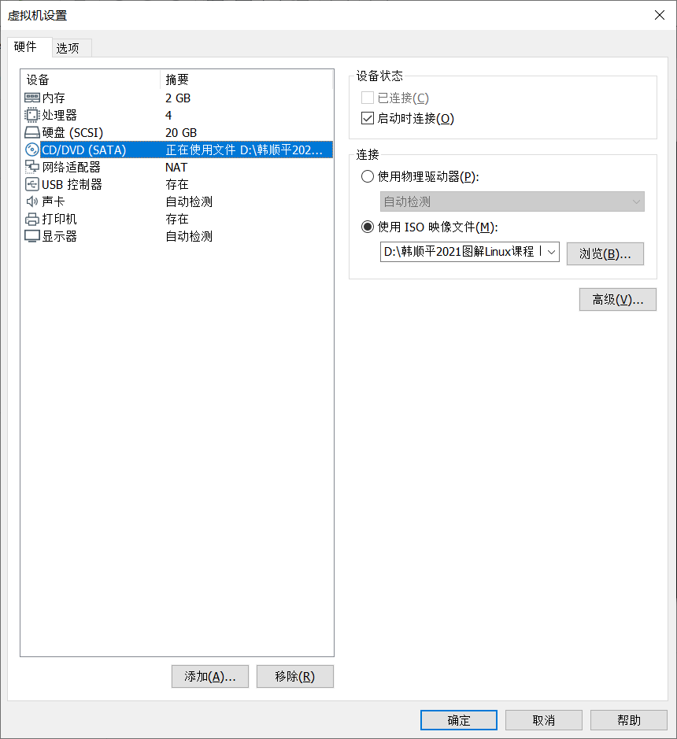

# How to Install CentOS
> [!TIP]
> Nowaways, 7 are the major system which most of the people are using, however, there's no doubt that CentOS 8 will be the major in the future.

# Link To Download (Click To Download)
[_LINK of CentOS_](https://www.centos.org/) https://www.centos.org/
 

[_Download CentOS_](https://www.centos.org/download/) https://www.centos.org/download/

# Recommand!
> [!TIP]
> **Find a video tutorial and follow the tutorial to download the centos 7**

# Steps of Installing CentOS

#### After you've checked the BIOS

#### Open up vmware and new a virtual machine
- **Choose the typical one**
- **Just in case, choose to set up the system later(the third choice)**

- **Choose to install the _Red Hat Enterprise Linux 7 64bit_**
  - That is because: CentOS is a branch of Red Hat
- **Give it a name, then put it in a place where has a large memory** (at least 20GB)
- **Give it _20GB_, then choose the second choice**
  - It stands for _Split the virtual disk into multiple files_
  - That will make the virtual machine become easier to be move on your machine

- **After that, you've finished the basic set up of the your CentOS Linux**

> [!TIP]
> **Then, we shall use the CentOS iso file we downloaded in the former paragraph**

#### Set up the setting of CentOS

> [!TIP]
> The following set-up should based on your own machine
- **For RAM, since I have 16GB RAM, I choose to give it _4GB_**
  - I suggest you to give it a quarter of your total ram, since you still need to support your own machine to operate
- **CPU**
  - **Press _CRTL+SHIFT+ESC_ to open the _Task Manager_**
  - 
  - **From the Task Manager, open the _Resource Manager_**
  - 
    - From the CPU, have a glance of how many core yoru CPU have
    - Mine, for instance, have 16
  - **Therefore, I gived 2 CPU to it, with 4 cores in total**
  - _The more you offer to it, the faster it is able to operate it._
- 
- **This is the most important part---The network**
  - Normally, we'll just choose the NAT, the detailed reasons will be listed in my next Article
- **After that, we need to add the iso into this virtual machine**
  - 
- **After that, we are ready to start the virtual machine**

