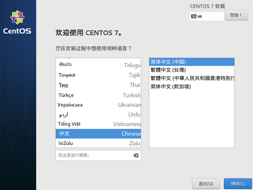

# Start Linux
> [!ATTENTION]
> **I suggest you to find a video tutorial and follow his/her steps to set up the CentOS system**

<iframe src="//player.bilibili.com/player.html?aid=583873963&bvid=BV16z4y1D7Lz&cid=210671917&page=1" width="1000" height="1000" scrolling="no" border="0" frameborder="no" framespacing="0" allowfullscreen="true"> </iframe>

- **After you've entered the CentOS system, double click to enter the interface of GUI**
  - 
  - Then Choose the first one, which is _Install CentOS 7_
- **Then you've entered this part, wait for a few minutes**
  - 
- **After that, there's a section where you are able to choose the language you want to use**
- 
- **Check whether the keyboard and time are correct or not, then enter the _Software Selection_**
  - 
  - I suggest you to select these options:
    - **GNOME DESKTOP**
    - **XWINDOWS SYSTEM Compatibility**
    - **Compatibility Library**
    - **Development tool**
  - However, if you want to develop your own, or you already have your own Linux system, it is fine for you to keep the _default setting_
- **Wait for a few minutes, then choose the _installation position_**
  - 
  - **Click the two thing that I marked in the pic below**
  - 
  - **If everything is going well, then...**
  - 
  - **Click the button here, then add these three partitions**
    - /boot
    - /
    - swap
  - 
  - 
  - 
- **The reason why we need the _swap_**
  - You can understand the swap as the _Virtual Memory_ in Windows, which stands as a RAM
  - 
  - When the physical memory is insufficient, take out part of the hard disk space and use it for swap partition (virtual memory), so as to solve the problem of insufficient memory capacity.
   
  - Swap means exchange. As the name suggests, when a process requests the OS for insufficient memory, the OS will exchange the temporarily unused data in the memory and put it in the swap partition. This process is called swap out. When a process needs these data again and the OS finds that there is free physical memory, it will exchange the data in the swap partition back to the physical memory. This process is called swap in.
   
  - Of course, there is an upper limit on the size of swap. Once the swap is used up, the operating system will trigger the oom killer mechanism to kill the process that consumes the most memory to free up memory.
- **After you've finished all of the steps, it comes to the _Last Part_ of setting up**
  - 
  - Kdump is a tool and service used to dump memory operation parameters in case of system crash, deadlock or crash. 
  - If you don't need to analyze the cause of kernel crash, you don't need to start it, and you can start it again when necessary.
- **Then it comes to the Network and Host Name**
  - 
  - Write your host name in the red box, then click finish
- **Now, you've finished the installation of CentOS**
  - After you set up your user name and passwords, of course
> [!ATTENTION]
> In work environment, your password has to be strong enough

- **After you've restart the virtual machine, it is nesseary for you to accept the licensing**
- **then enter the system in _root_(Not listed, need to add that by yourself)**
  
> [!TIP]
> > **congratulations!!**
> **Now, you've set up the environment of Virtual Machine!**
